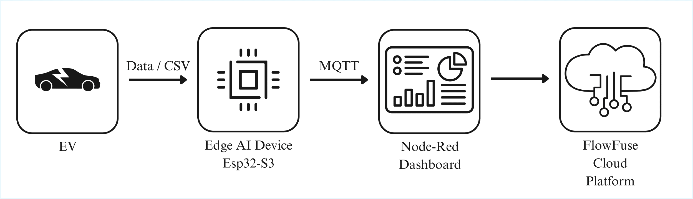
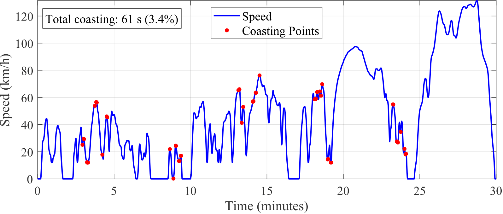
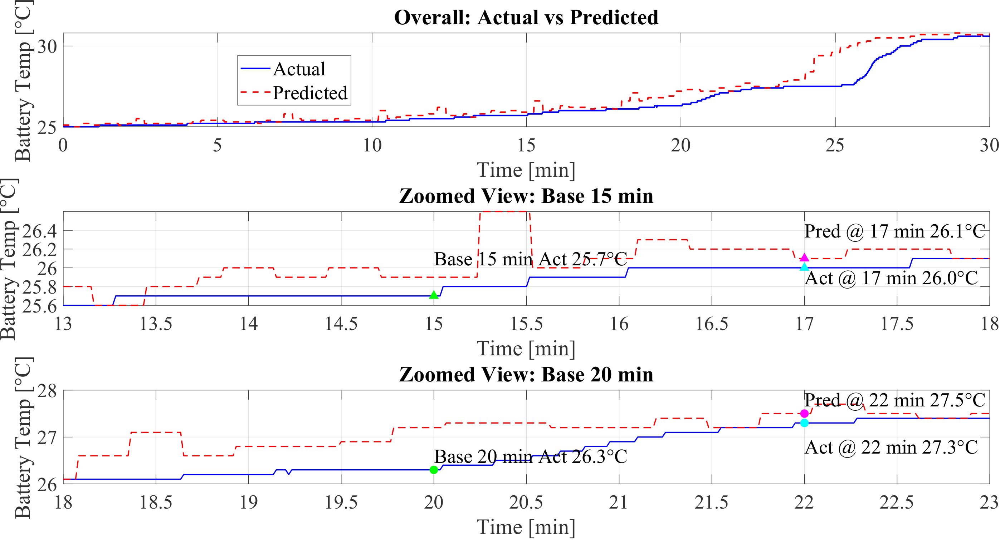

# 🚗 Edge AI System for EV Trip Analytics: On-Device WLTP Class 3B Processing and Battery Temperature Prediction

This project presents a high-performance edge computing framework developed on the **ESP32-S3** microcontroller. It is designed to process electric vehicle (EV) telemetry at **1 Hz** to provide immediate feedback on driving efficiency and battery safety without relying on cloud servers.

## 🌟 Key Technical Features

* **Dual-Core Architecture:** Core 0 handles **Wi-Fi** connectivity and asynchronous **MQTT** telemetry. Core 1 executes real-time physics calculations and **TinyML** inference.
* **Predictive Thermal Management:** Features a neural network that predicts battery pack temperature **120 seconds** into the future.
* **High Precision:** The AI model is extremely accurate with a Mean Absolute Error (**MAE**) of **0.09 °C**.
* **Real-Time Dashboard:** Sends data summaries in **JSON** format via **MQTT** to a Node-RED dashboard for driver visualization.

## 🔌 Hardware Setup
* **MCU:** ESP32-S3 (Dual-Core, 240MHz)
* **Connectivity:** Wi-Fi (2.4 GHz) for MQTT communication.
* **Data Source:** Simulated WLTP Class 3b telemetry engine (1 Hz).

## 📊 Research Methodology and Data

* **Standardized Input:** The system is tested using the **WLTP Class 3b** driving cycle, representing urban, suburban, and highway phases.
* **1 Hz Telemetry Engine:** Processes 10 key parameters every second, including speed, acceleration, and battery current.
* **On-Device Event Detection:** Detects coasting segments based on near-zero acceleration and current thresholds.

## 📈 Driver Scoring Logic
The system calculates a real-time efficiency score based on the following weighted parameters:

| Parameter | Weight | Description |
| :--- | :--- | :--- |
| **Energy Consumption** | 35% | Net energy efficiency vs. distance. |
| **Regeneration** | 25% | Efficiency in energy recovery during braking. |
| **Temperature** | 15% | Predicted battery thermal safety margin. |
| **Current Draw** | 15% | Peak current management and discharge rates. |
| **Coasting** | 10% | Utilization of vehicle inertia for energy saving. |

## 🛠️ Tech Stack & Libraries

* **Frameworks:** ESP-IDF (Task Multitasking) and Arduino.
* **AI and ML:** Edge Impulse (**TinyML**).
* **Protocols:** MQTT (Telemetry), JSON (Data Format), and LittleFS (On-device storage).
* **Key Libraries:** `ArduinoJson`, `PubSubClient`, `EdgeImpulse SDK`.

## 📈 Analytics and Performance Results

* **Energy Consumption:** Calculates instantaneous and cumulative net energy, matching offline MATLAB analysis.
* **Thermal Accuracy:** On-device inference matches actual battery trends throughout the 30-minute WLTP Class 3b trip.
* **System Integrity:** Lossless 1 Hz telemetry delivery confirmed with **1801 out of 1801** messages received successfully.

## 🚀 Getting Started
1. **Clone the Repo:** `git clone https://github.com/nabeel1992-sys/Thesis_Project.git`
2. **Environment:** Open the project in **VS Code (PlatformIO)** or **Arduino IDE**.
3. **Dependencies:** Ensure `ArduinoJson` and `PubSubClient` libraries are installed.
4. **Build & Flash:** Connect your ESP32-S3 and flash the firmware.

## 📂 Repository Organization

* `/EV_EdgeAI_Main`: Main firmware and integrated Edge Impulse SDK.
* `/Node-RED`: Includes `flows.json` required for the dashboard.
* `/Data`: WLTP datasets and training CSV files.
* `/images`: Technical graphs and dashboard screenshots.

---
**Developed as part of a Master's Thesis project at Lappeenranta-Lahti University of Technology (LUT), Finland.**
