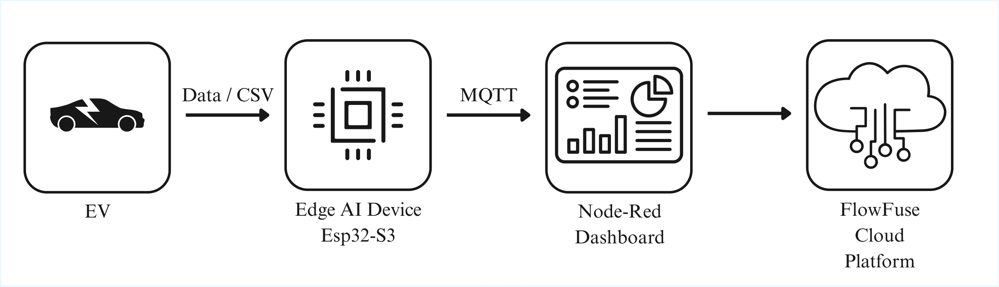
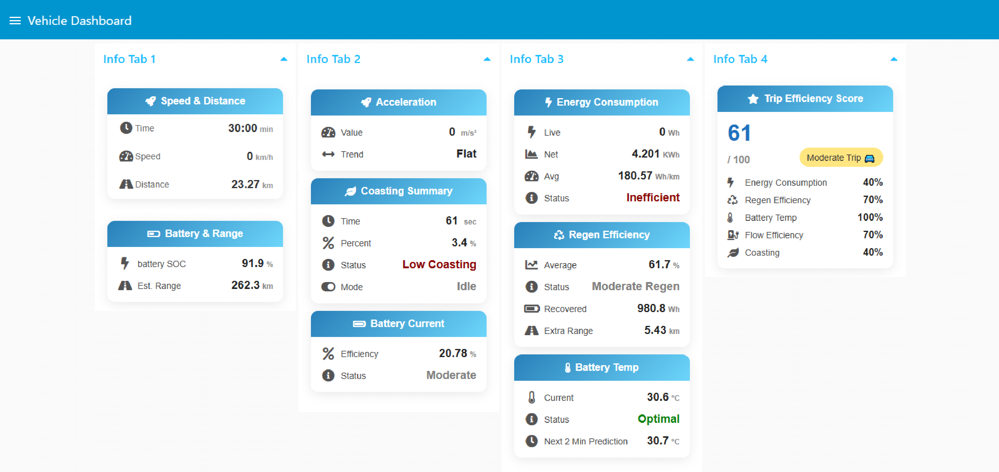
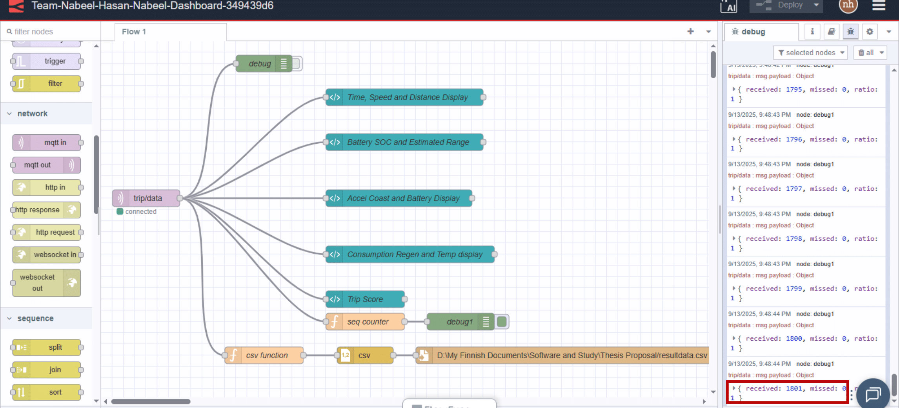
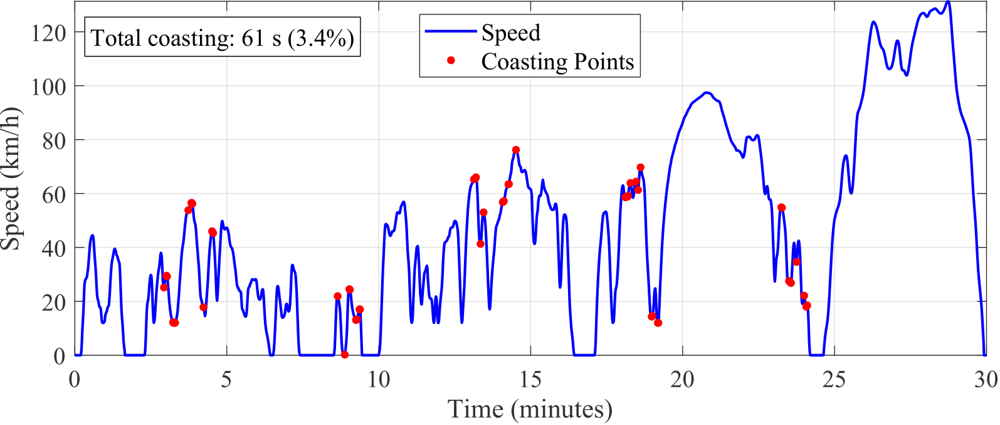
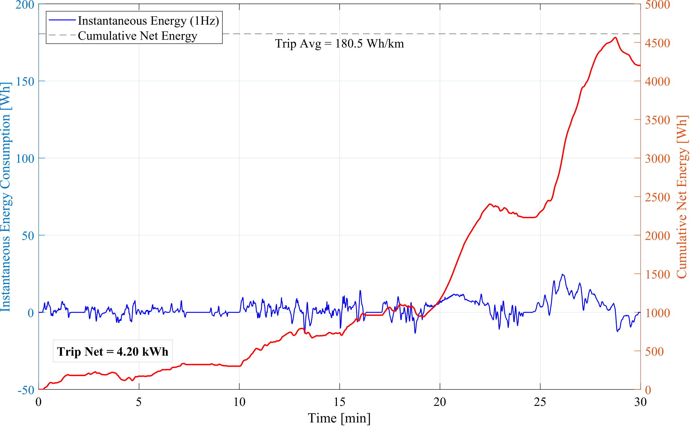
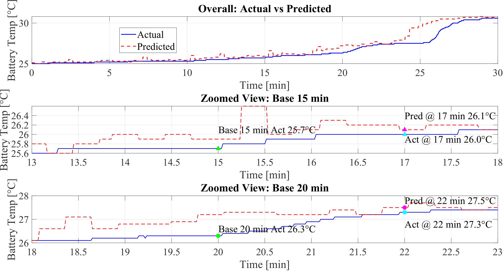

# Edge AI System for EV Trip Analytics 🚗⚡
**On-device WLTP Class 3B Processing and Battery Temperature Prediction**

> **Publication Note:** This repository contains the firmware, modular architecture, and reference implementation for the research paper accepted at the **SAI Computing Conference (July 2026, London)**.

This project implements a real-time Edge AI telemetry system designed to run entirely on an **ESP32-S3 (N16R8)**. It processes Electric Vehicle (EV) Worldwide Harmonized Light Vehicles Test Procedure (WLTP) data, evaluates driver behavior, and runs TinyML inference to predict battery temperature rise at the edge, without relying on cloud processing.



## ⚡ Key Features
* **Dual-Core RTOS Architecture:** Core 1 is dedicated to processing CSV telemetry, running math functions, and executing ML inference. Core 0 handles background network tasks (WiFi and MQTT) to prevent blocking.
* **TinyML Battery Temperature Prediction:** Integrates an Edge Impulse neural network model that forecasts thermal variations based on real-time current, acceleration, and coasting data.
* **Comprehensive Driver Scoring:** The algorithm evaluates the trip across 5 metrics: Energy Consumption, Regenerative Braking Efficiency, Battery Temperature, Flow Efficiency, and Coasting percentage.
* **Local Telemetry & Dashboard:** Publishes over 25 processed JSON parameters per second via MQTT to a Node-RED environment for real-time visualization.
* **Enterprise-Grade C++ Structure:** Strictly follows the Single Responsibility Principle (SRP) by segregating network, analytics, scoring, file parsing, and JSON building into independent modules.

## 📊 Analytics and Visualizations

### Real-Time Vehicle Dashboard
The telemetry data is ingested by Node-RED, parsed, and displayed on a local dashboard providing live metrics on speed, battery SOC, estimated range, and trip efficiency scores.



### Node-RED Flow
A lightweight, efficient Node-RED flow processes the incoming MQTT packets (`trip/data`), formats the JSON payload, dynamically updates the UI, and logs the processed data back into a CSV file for post-trip analysis.



### Driving Behavior & Energy Analysis
The system tracks mechanical and electrical parameters at 1Hz. Key analytical outputs include coasting point detection and instantaneous vs. cumulative energy consumption tracking.

**Coasting Analysis:**


**Energy Consumption Tracking:**


### Edge ML Temperature Prediction
Using TensorFlow Lite for Microcontrollers (via Edge Impulse), the system successfully tracks and predicts battery temperature curves during the WLTP drive cycle.



## 📂 Repository Structure
```text
📦 Edge_AI_EV_Project
 ┣ 📂 data                  # Contains the WLTP_Class3b_1Hz_full.csv file (uploaded via LittleFS)
 ┣ 📂 include               # Header files defining cross-module structs and variables
 ┣ 📂 lib                   # External dependencies and the Edge Impulse exported Arduino Library
 ┣ 📂 node_red              # Contains flows.json for importing the dashboard UI
 ┣ 📂 src
 │ ┣ 📜 main.cpp            # Main orchestrator (Setup and Core 1 Loop)
 │ ┣ 📜 config.h            # Global macros, thresholds, and MQTT/WiFi credentials
 │ ┣ 📜 network_task.cpp    # FreeRTOS WiFi/MQTT background task (Core 0)
 │ ┣ 📜 csv_parser.cpp      # String parsing into typed CsvRow structs
 │ ┣ 📜 analytics.cpp       # Physics, battery metrics, and EMA calculations
 │ ┣ 📜 scoring.cpp         # Driver behavior evaluation logic
 │ ┣ 📜 ml_inference.cpp    # Edge Impulse TinyML execution wrapper
 │ ┣ 📜 json_builder.cpp    # MQTT payload formatter
 │ ┗ 📜 shared_state.cpp    # Mutexes and globally shared state instances
 ┣ 📂 images                # Architecture and result visual assets
 ┗ 📜 platformio.ini        # Build flags, PSRAM config, and LittleFS setup

 ## 🛠️ Setup and Installation
### Hardware: ESP32-S3 DevKit (16MB Flash, 8MB PSRAM recommended).

Environment: VS Code with the PlatformIO extension.

Configuration: * Update WIFI_SSID, WIFI_PASSWORD, and MQTT_BROKER_IP in src/config.h.

Ensure board_build.filesystem = littlefs is set in your platformio.ini.

File System Upload: * Click the PlatformIO icon -> Project Tasks -> env:esp32-s3-devkitc-1 -> Platform -> Build Filesystem Image followed by Upload Filesystem Image to move the dataset to the board's flash memory.

Firmware Upload: Build and Upload the main firmware code using the standard PlatformIO arrow → button.

Dashboard Setup: Open your Node-RED instance, select Import from the top-right menu, and load the node_red/flows.json file. Ensure your local MQTT broker (e.g., Mosquitto) is running and configured correctly.

🎓 Academic Context
This project was developed and submitted as a Master's Thesis for the Master of Science in Electrical Engineering program at Lappeenranta-Lahti University of Technology (LUT), Finland.

📜 License
Distributed under the MIT License.